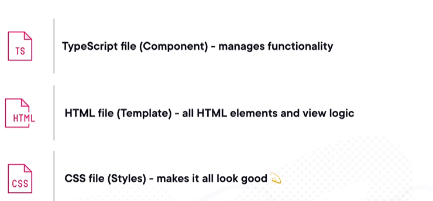
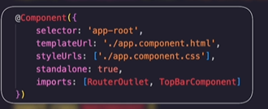
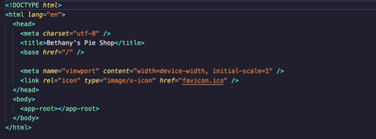

# AngularPluralsight

Angular is an open source front-end framework developed and maintained by Google designed for building modern, dynamic, and scalable web applications.
Or differently, angular is a framework to build websites, no matter the size and level of detail needed.
It is framework, so it is pre-written code, with useful tools and structured guidelines all packaged to create web applications of any size.

# Some tips

Angular releases a new version every six months. It has a built-in feature that uses schematics that updates the code for us, every time a new release gets out.
The CLI tool helps us generate components and start the app from scratch.
The folder node_modules contains all the files and external modules that are needed to actually run the application. It can be though of as a cache because the node_modules folder can be entirely recreated from scratch at any time by just reinstalling all the dependent modules (that should be listed in your project folders). When hosting in a different evironment is preferable to reinstall everything instead of copying it.

# Advantages of Angular and features

1. Cost reduction and safety: a lot of built-in features and work done for us.
1. It is Standars compliant (run more browsers, more secure, suports modules, internalization, and accessbile to those with disability etc)
1. Open source
1. It is performant.
1. Typescript: cheaper, faster and easier to develop and maintain apps of decent size (type safety at compile time).
1. Signals library to make state synchronization simple.
1. Backed by google.
1. Uniformity (onboard developers easy).
1. Enterprise first.
1. Extensive documentation.

Due to the opinionated nature, there are a lot of decisions the team does not need to make (use typescript?).

# Basic features

Angular allows progressive web apps: apps that can be installed in phones, mobile.

1. Lazy loading.
1. Forms: template and reactive.
1. Reactivity: state changes and reactive data. Considered on of the most robust ways to build apps.
1. Fully featured router.
1. Animations library.
1. Strictly typed forms.
1. CLI and updates.

# Advanced features

Angular supports some features that require more experienced developers to implement. Those are:

1. Server'side rendering. It is the process of rendering the initial page view on the server. The server creates the HTML and CSS and sends it all down to the browser, instead of the front-end framework do the job. This makes the intial page view much faster.
1. It is mobile friendly.
1. Full reactivity.
1. ngUpgrade library: migrate angular Js to Angular.

# Angular Architecture

Angular breaks down large projects into smaller parts that are easier to manage, maintain and with functionality that can be reused. These parts are called _Components_.
Each component manages what the user sees through the use of templates, by mixing HTML elements with project data. Each component template can be styled with CSS.
Angular provides a way to use logic in the templates via directives (conditial, etc).
Components are self-contained chunks of functionality managing how something shows up for the user and all the logic for that piece of the application.
When some heavier work needs to be done, something that will be used across the entire application (authentication, notifictions) we can use what angular calls services. The service is the place to put logic that can be reused.
Angular uses typescript that, when compiled, is transformed in javascript. It allows types, cleaner code and less errors.

# Components

They are the foundation of every angular app. They break large projects into smaller, more manageable pieces.
The _Index_ file holds everything together. It is not a component but it is the base.
When the angular app first loads, this is where the user starts.
In this example app, there are only six components.
Every angular app has an _app component_, which acts as a shell or a base for all the other compoenents.
Then we have the topbar component, which handles navigation, it is shared across component, etc...
It is up to us to choose which components to create, how to style and how they interact with the rest of the app.
Each components should be small and focused on one responsibility: single responsibility principle.

Each component has the following files:


The first component to look at is the app component, which is common to all Angular apps and act as the foundation of our app and the inclusion of other components.
Each component is dividend in 3 sections:

1. The class itself (where we define core functionality of the component).
1. The metadata of the component. Information angulars need to connect all pieces.
   The selector is how we identify the name of a custom html element that will be used inside a template:
   
   We are identifying where this component will appear in our app. Example in the index.html file, that lives at the root of the project, we have the same app root tag:



So whatever happens inside the app component, all the html is going to be dynamically generated in this exact location in the HTML code.
How it is structured and how it looks are configured in the next two pieces of metadata: the template url (the html code for this component) and style url (css code for this component).
Standalone equals true means that we don't have to use Angular or Ng modules to define template dependencies.
The last piece defines the dependencies we want to use inside our templates. In this case we want to have a top bar always available so it is on our template. We also define routing. Routing should be cheked here.

# Templates

Templates are all about the user, what they see. This is where the HTML lives. It decides how the app looks like, but on a smaller scale. It is tied to the component. Example of our app component html:

```
<app-top-bar></app-top-bar>

<section class="main-content">
  <router-outlet></router-outlet>
</section>
```

This is the app main component. Top bar is always visible. It is going to be the selector of content that hold the navigation for the app.
The _<router-outlet>_ element is the built-in router destination we imported in the app component.
This is where all the components that are controlled by the navigation will be displayed, like shopping kart, etc.

If we inspect now the top bar component, we see a few differences.

```
import { Component, computed, inject } from '@angular/core';
import { RouterLink } from '@angular/router';
import { CartService } from '../services/cart.service';
import { NgIf } from '@angular/common';

@Component({
    selector: 'app-top-bar',
    templateUrl: './top-bar.component.html',
    styleUrls: ['./top-bar.component.css'],
    standalone: true,
    imports: [RouterLink, NgIf]
})
export class TopBarComponent {
    cart = inject(CartService); // Inject the CartService.

    cartCount = this.cart.cartCount;
}

```

1. The files for the template and styles are now different.
1. We have a router link related dependency as well.

It is normal to have differences between components, because components have a single responsibility.
Looking at the top bar template, we can see that navigation related functionality stands out, by seeing several [routerLinks]: one for the shop page, another for the contact page, etc:

```
<header class="site-header">
    <div class="site-header-wrapper">
      <h1><a [routerLink]="['/']"></a></h1>
      <nav>
        <ul>
          <li><a [routerLink]="['shop']">Shop</a></li>
          <li><a [routerLink]="['contact']">Contact</a></li>
        </ul>
      </nav>
      <div class="header-icons">
        <ul>
          <li class="cart-icon">
            <a [routerLink]="['cart']"></a>
            <span *ngIf="cartCount()" class="cart-count">{{cartCount()}}</span>
          </li>
        </ul>
      </div>
    </div>
</header>

```

Everything in this template is vanilla HTML code except for this router link.
Going back to the app component template, we see the router outlet is the placeholder in the template where the components will be shown, rotated in and out and the [routerLink] is how we tell angular which component we want to show up.
How we define the routes? Routes are defined ahead of time in the _app.routes.ts_. We are mapping routes here with a path, which is sufficient for now.
How is this routes file loaded? This file is configured in a file called _app.config.ts_ that contains not only the routes but the configuration of our app.
App.config.ts is loaded by the file _main.ts_.
_main.ts_ is considered the entry point of the application.

# Directives, pipes and Data binding

Directives in angular are special instructions that we can place directly inside the HTML elements to modify the behavior or appearance of those elements.
They are a way for us to accomplish common programming, like controlling the flow but inside the HTML template.
With directives we can conditionally control visibility of elements, apply custom class names, CSS styles, based on different conditions.
We can see a first example in the product-list component: the _ng-for_ directive.
We iterate over a collection of products, defined in the _product.ts_ folder and display each one in the page:

```
<h2>Pies and Cakes</h2>
<div class="gallery-wrapper">
    <div *ngFor="let product of products" class="pie-item">
        
        <div class="pie-info">
            <h4>{{ product.name | titlecase }}</h4>
            <p>{{ product.price | currency}}</p>
        </div>
        <div class="add-to-cart">
            <p><a (click)="addToCart(product)">+ Add to cart</a></p>
        </div>
    </div>
</div>
```

In our example we used a static file, real world scenario would come from a database. For each product we show a name, price, and add an event handler, mapped to the add to cart function in the component file. The product is a type model, defined as a typescript interface.
This mechanism of getting the actual data into the html template is called data binding.
We surround the models property name under curly braces when we want to render the value as text. This is one way Angular does data binding, called interpolation.
When we want to use the data as a property in HTML like a class id or as a src for an image we use square brackets (property binding).
Like we have said, we handke events, like buttons clicks to add the pies to the cart. This is called event binding.

Pipes is another feature of Angular that allows the transformation of data in our templates. they make it easier to modify the appearance or behavior in the template.
Angular has a lot of built in pipes. Examples in our template:

```
<p>{{ product.price | currency}}</p>
```

We are showing here the product price, followed by the pipe char and we specify the pipe currency. This tells angular to display the price in a currency format.

# Services

We need to share functionality across the applications, functionality that is cross component, like adding items to the cart from a prodcut list page.
We also need to interact with a cart when we finalize an order.
Services is what is used in angular to share code and data between components and other parts of the application.
Services can be used for:

1. Fetch data from APIs
1. Manage authentication
1. Business logic
1. Custom functionality shared across the app.

Let's inpect our CartService:

```
import { HttpClient } from '@angular/common/http';
import { Product } from '../models/products';
import { Injectable, inject, signal } from '@angular/core';
import { ShippingPrice } from '../models/shippingPrice';

@Injectable({
  providedIn: 'root' // This service is provided in the root injector for your app and should be available globally.
})
export class CartService {
  private http = inject(HttpClient); // Inject HttpClient to make HTTP requests.
  items: Product[] = []; // Array to hold the items in the cart.
  cartCount = signal<number>(0); //use signal to create a reactive variable

  // Method to add a product to the cart.
  addToCart(product: Product) {
    this.items.push(product); // Add the product to the items array.
    this.cartCount.set(this.items.length); // Update the cart count signal.
  }

  // Method to get the items in the cart.
  getItems() {
    return this.items;
  }

  // Method to clear the cart.
  clearCart() {
    this.items = []; // Empty the items array.
    this.cartCount.set(0); // clear the cart count signal.
    return this.items;
  }

  // Method to get the shipping prices from a JSON file.
  getShippingPrices() {
    return this.http.get<ShippingPrice[]>('./assets/shipping.json');
  }

  // Method to get the subtotal of the items in the cart.
  getSubtotal() {
    return this.items.reduce((sum, item) => sum + item.price , 0); // Use reduce to sum up the prices of the items in the cart.
  }
```

We can see that our cart service has an array of products, a method to add things to the cart, clears the cart, etc

We can see a decorator called injectable. This is how we tell angular we are creating a service and allows us to use the built in angular dependency injection.
If we go to our components classes, we will see the inject derivatives.
With this, angular will create the service and share the cart across multiple components. We can reuse code, share data, and separate concerns like putting business logic in services, separate from the presentation layer.

In a nutshell, Angular provides a tool to build interactive applications, that can talk to server, fetch and display data, manage state for that data and react to state chnages in that data.

# One way data flow

When a state changes on a parent control (when a user clicks a button for example), all the child components check their own internal state, one what is called a change detection cycle.
The components are re rendered with a new state. This flow always goes down and never up. Once a state change cycle begins, state is not allowed to change nay further until the cycle is completed. This prevents cascade changes and it is a foundation of many modern frameworks.

Also on state changes, Zone.js is the key to Angular change detection. Angular subscribes to notifictions from zone.js, that create a wrapper around user interactions, http, timers.
This lets angular run the change detection cycle and minimize the rendering and make the application efficient.

Example: we change user first name. As a result the full name changes. We only render when bith state changes are finished, intead of rendering twice.

# rendering targets

Most modern frameworks today allow not only running the code on a browser, but also in mobile, render on the server, have a native desktop expirience.

# Tools and Ecosystem

Just have a look into what needs to be considered when build a javascript application:


Try put all this pieces together by hand on an enterprise livel grade application..
The CLI handles all of that for you..

The CLI can:

1. Create new applications and set them up correctly
1. Create new components, services, pipes, etc.
1. Act as the webserver during development
1. Linting
1. Testing
1. Building

A tool called Angular Universal is responsible for the server side rendering.
It increases performance by limiting the intial download size and render time, by avoiding the client side framework parsing templates, build dom nodes etc.

It helps with search engine optimization.
there several rendering modes:

1. Full pre-rendering which involves running a development-time process which will take your application and create HTML for each views. Then load the HTML, load it onto a content delivery network and then people get fast initial views when they hit the site. then Angular will make the switch to a regular client rendered app.
1. Dynamic pre-render: whenever a request is received by the web server, the requested page is built by Angular Universal, and the HTML and CSS is sent down to the browser and after that, the switch happens.

In either mode there is a client-side switch:

1. The app is downloaded
1. In a hidden div it boots the app and renders the current page.
1. Replays the events of the user to restore state.
1. Swtich to client rendered app.

This is a consideration because the first time the app is loaded, the browser needs to download the entire app, including the angular framework etc.. which can show delay during the first rendering.

# Mobile and Desktop

For mobile angular provider Ionic and NativeScript.
For desktop Electron is widely used to build native desktop apps, like VS CODE!!!, using angular.

# Testing

Angular team built tools for unit testing like Karma. There are other tools like Jest
Protractor used for end2end but is no longer maintained. Other tools like Cypress and Playwright can be used.

There are other utilities like TestBed to test component template. Async an dfakeAsync to test async code.
MockBackend: helps mocking out an HTTP server for example.

Check AOT and Ivy. These are angular key inovations that increase performance when compared to other java script framweworks.

# Ecosystem

NgRx is the de-facto state management library for Angular. Nx is a model repo built fron the ground up for aunglar projects.
Angular material is an implementation of googles material project.

# Next Steps

For other topics, or digging deeper to concepts described in this document, please refer to other angular application examples:

1. Template forms:
1. Reactive forms:
1. Routing and Navigation:
1. Angular signals:
1. Testing
1. CLI
1. Deployment

If you want to experiment with angular, there is a tool called StackBlitz that lets you do that in the browser.
